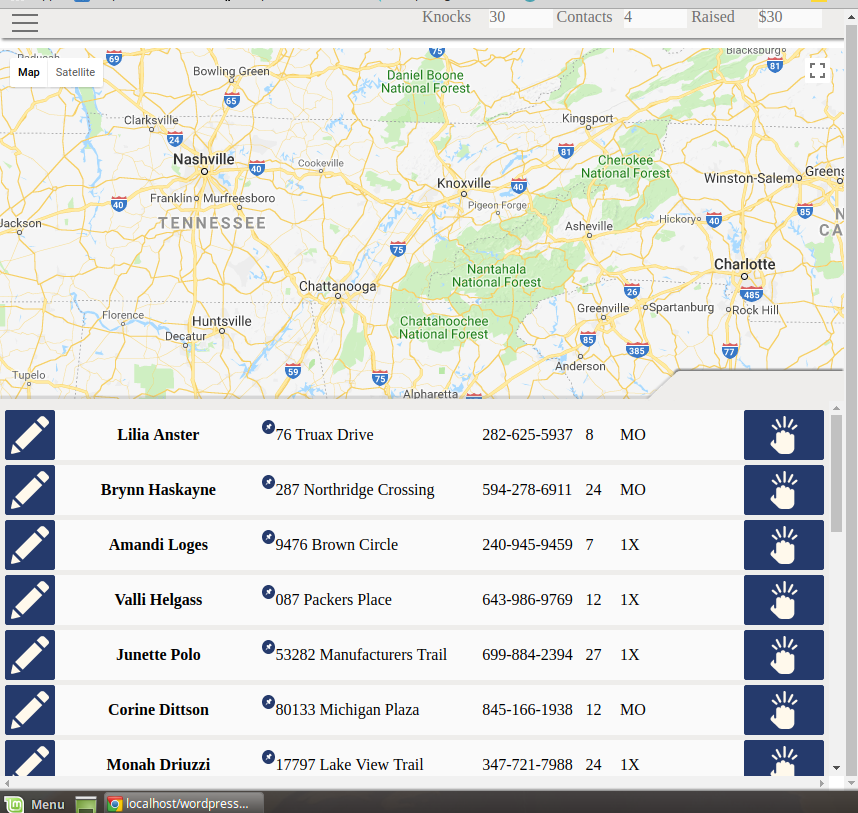

This is a Door to Door application built on wordpress.

I was inspired to build this application after working as a door to door fundraiser for a non-profit. The user interface is optimized for use on tablets with fat fingered gloves in all weather conditions. By uploading a CSV file to the Wordpress Admin panel the user will be able to populate the list with the contact data of potential donors. The GUI is built to assist in gathering data during Door to Door fundraising and allow for quick and easy navigation. The Contact List panel on the bottom can be resized over the map by touching or clicking the tab and dragging. By clicking the 'Knock' button each contact reveals a set of buttons to record the answers to various questions and send them back to the database.

